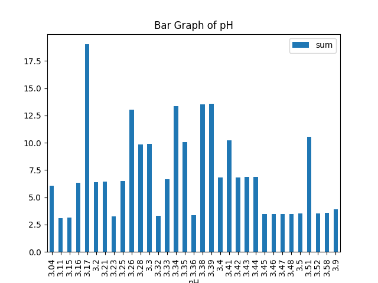

# REPORT ON GRAPHS AND PLOTS
---
### __Scatter Diagram of density against residual sugar__

The graph above is a scatter plot of density against residual sugar. 

---
### __Plot Diagram of pH__

- The graph above shows a graph of the dataset with pH as the grouping.
- From the graph, the highest pH count recorded is seen to be around 3.3 with a count above 50.
---

### __Scatter Plot of fixed acidity against pH__

- This plot shows a scatter diagram of fixed acidity against the pH of the wine.
- The scatter plot is most concentrated between 6 and 12 on th fixed acidity axis and between 3.0 and 3.6 on the pH axis.
- The scatter plot has a negative correlation
---

### Bar Graph of pH values 

- The image above is a graph of the count of pH of the sames value in a bar graph format.
- Since the dataset is large, the graph only displays for the first 70 rows of the red wine data set. 